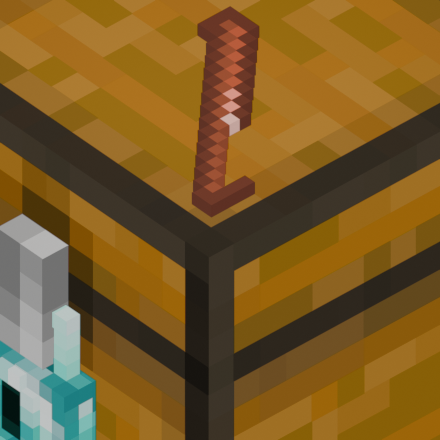

  
<h1 class="mc-text">Lock Picking</h1>

---
This mod adds a simple lock picking minigame that was inspired by the same mechanic in Kingdom Come: Deliverance. This mod is designed to be used in combination with other RPG mods, and aims to reach classic RPG games expirience.

Lock picking

> **Lock picking process**\
Simply right click on the locked chest _with lockpick in your hand_, and the lockpicking UI will appear.\
Then _hold_ the right mouse button and drag it clockwise.\
\
The better lock you are trying to open, the thinner will be the line on which you should drag the cursor.

Redstone features

> When you successfully lockpick, lock emits short redstone signal\

> Sculk sensors also react to lockpicking\

Guard Villagers interaction

> Nearby guards will attack you if they hear you lockpicking

